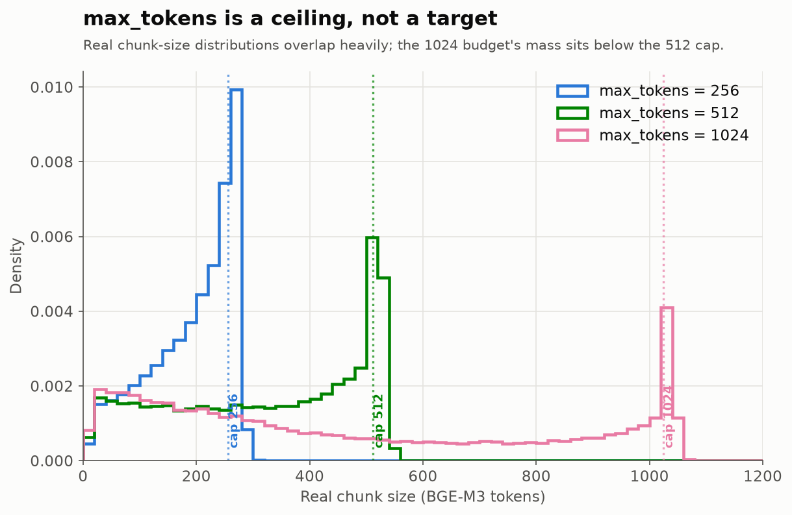

# ADR 0001 — Stratégie de retrieval : dense vs BM25 vs hybride RRF vs reranker

## Statut

Accepté.

## Contexte

Corpus : 368 filings SEC parsés avec Docling, chunkés avec le `HybridChunker`
(budget 512 tokens, tokenizer BGE-M3). Index Qdrant `docling_hybrid_512_bge-m3`
(183 687 points, embeddings BGE-M3 en fp16). Jeu de questions : les 150 QA
FinanceBench (open-source), chacune rattachée à un `doc_name` (le filing dont
elle provient).

Deux réglages de recherche sont mesurés séparément :

- **global** : le retriever cherche dans les 368 documents (aucune information
  sur le bon document).
- **doc-scoped** : le retriever est restreint au `doc_name` de la question
  (champ fourni par le dataset lui-même — un réglage « document connu »
  standard, pas une fuite).

Métriques : recall@k, precision@k, MRR, nDCG@k (k ∈ {1,3,5,10}), avec
pertinence définie au niveau **page** (page gold résolue par recouvrement
lexical entre l'evidence et le corpus, dédupliquée par page).

## Options considérées

1. **Dense** — BGE-M3 + Qdrant (similarité cosinus).
2. **BM25** — lexical pur (`rank-bm25`), IDF calculé sur tout le corpus.
3. **Hybride** — fusion dense + BM25 par Reciprocal Rank Fusion (RRF).
4. **Reranker** — cross-encoder (`BAAI/bge-reranker-v2-m3`) qui re-score un
   shortlist (`prefetch=50`) issu de n'importe lequel des trois retrievers
   ci-dessus, par attention croisée query↔chunk (impossible pour un
   bi-encoder, qui embarque les deux textes indépendamment).
5. **Taille de chunk** — budget du `HybridChunker` (tokenizer BGE-M3) :
   256 / 512 / 1024 tokens, corpus et collection Qdrant séparés par taille.

## Résultats

Toutes les lignes ci-dessous évaluent les 150 QA (0 skip), corpus
`docling_hybrid_512_bge-m3` (chunker hybrid, 512 tokens).

| # | Retriever | Scope | recall@1 | recall@3 | recall@5 | recall@10 | MRR | nDCG@10 |
|---|---|---|---|---|---|---|---|---|
| v0 | dense | global | 0.130 | 0.190 | 0.230 | 0.297 | 0.182 | 0.205 |
| P1 | **dense** | **doc-scoped** | **0.227** | **0.332** | **0.402** | **0.552** | **0.338** | **0.377** |
| P2 | bm25 | doc-scoped | 0.113 | 0.176 | 0.222 | 0.261 | 0.160 | 0.183 |
| P2 | hybride RRF (naïf : pf=100, poids égaux) | doc-scoped | 0.166 | 0.229 | 0.252 | 0.340 | 0.223 | 0.247 |
| P2 | hybride RRF (réglé : pf=20, w_bm25=0.3) | doc-scoped | 0.173 | 0.286 | 0.361 | 0.556 | 0.288 | 0.343 |
| P3 | **reranked(dense)** (prefetch=50) | doc-scoped | **0.290** | **0.466** | **0.549** | **0.649** | **0.433** | **0.473** |
| P3 | reranked(bm25) (prefetch=50) | doc-scoped | 0.199 | 0.252 | 0.272 | 0.320 | 0.242 | 0.256 |
| P3 | reranked(hybrid) (prefetch=50) | doc-scoped | 0.290 | 0.466 | 0.549 | 0.649 | 0.433 | 0.473 |

Balayage complémentaire (rankings dense/BM25 collectés une fois, fusion
recalculée en mémoire, profondeur de pool `pf` × poids BM25 `w_bm25`,
`recall@10` uniquement) :

| pf | w_bm25=0.25 | w_bm25=0.5 | w_bm25=1.0 |
|---|---|---|---|
| 10  | 0.552 | 0.552 | 0.464 |
| 20  | 0.556 | 0.556 | 0.447 |
| 100 | 0.507 | 0.430 | 0.340 |

(repère : dense seul = 0.552)

## Analyse

**Doc-scoped vs global.** Restreindre la recherche au document gold fait
presque doubler le recall@10 (0.297 → 0.552). Le réglage global mélange deux
sous-tâches — router vers le bon document et retrouver le bon passage —
alors que FinanceBench fournit le document cible. Le doc-scoped isole la
qualité de retrieval de passage ; c'est la métrique retenue comme référence
pour la suite des expériences.

**BM25 est nettement plus faible que le dense sur ce benchmark**
(recall@10 = 0.261 vs 0.552). Les questions FinanceBench sont formulées en
langage naturel et paraphrasent le texte du filing (« capital expenditure »,
« capex », des tournures variables) ; l'embedding sémantique de BGE-M3 capture
mieux cette reformulation que le recouvrement lexical exact de BM25.

**La fusion RRF naïve (pool profond, poids égaux) dégrade le résultat**
en dessous du dense seul (0.340 vs 0.552) : à profondeur pf=100, BM25 injecte
dans le classement fusionné des chunks de mauvaise qualité qui délogent les
bons résultats du dense. Un RRF **réglé** (pool peu profond pf=20, poids BM25
réduit à 0.3) permet de retrouver le niveau du dense, mais sans le dépasser
significativement (0.556 vs 0.552, soit +0.4 point — dans le bruit) — et reste
**inférieur** au dense seul sur recall@1, recall@3, recall@5, MRR et nDCG@10.

**Le reranker apporte le premier gain net et large sur toutes les métriques.**
`reranked(dense)` passe le recall@10 de 0.552 à 0.649 (+0.097), mais le gain le
plus net est sur les rangs précoces et le classement : recall@1 +0.063,
recall@3 +0.134, recall@5 +0.147, MRR +0.095, nDCG@10 +0.096. Contrairement au
RRF, qui ne fait que réordonner deux classements approximatifs par rang, le
cross-encoder évalue chaque paire (question, chunk) avec attention croisée —
il corrige des erreurs de classement que le bi-encoder ne peut pas voir (ex.
remonter en tête un chunk contenant le bon chiffre dans un tableau, que
l'embedding avait sous-classé). C'est cohérent avec l'hypothèse de ce document :
le recall@10 modeste du dense seul venait davantage d'un problème de
**classement fin** que d'un problème de couverture (le bon chunk était souvent
récupéré, juste mal classé).

**Le reranker améliore aussi BM25, mais ne peut pas compenser un premier étage
faible.** `reranked(bm25)` gagne sur toutes les métriques par rapport à BM25
seul (recall@10 0.261 → 0.320, MRR 0.160 → 0.242, nDCG@10 0.183 → 0.256) — un
schéma de gain similaire à `reranked(dense)`. Mais son niveau absolu
(recall@10 = 0.320) reste très en dessous de `reranked(dense)` (0.649) : le
reranker ne re-score que les `prefetch=50` candidats déjà remontés par la
première étape, donc son recall est plafonné par le recall@50 du retriever de
base. Si le bon chunk n'est pas dans le top-50 de BM25, aucun reranking ne
peut le rattraper. Ça confirme que **la qualité du premier étage reste
déterminante** : le reranker amplifie un bon retriever, il ne corrige pas un
retriever faible.

**`reranked(hybrid)` est numériquement identique à `reranked(dense)`** (mêmes
métriques à la 4e décimale, run reproduit deux fois). Ce n'est pas une
coïncidence ni un bug : c'est une conséquence directe des poids RRF réglés en
P2. Avec `dense_weight=1.0`, `sparse_weight=0.3`, `rrf_k=60` et une profondeur
de prefetch de 50, le pire score qu'un chunk du dense peut obtenir (rang 50)
est `1.0/(60+50) ≈ 0.00909`, strictement supérieur au meilleur score qu'un
chunk **exclusif à BM25** peut obtenir (rang 1) : `0.3/(60+1) ≈ 0.00492`. Aucun
chunk propre à BM25 ne peut donc jamais entrer dans le top-50 fusionné — la
fusion ne fait que réordonner les 50 chunks du dense. Vérifié par le code :
pour un échantillon de requêtes, l'ensemble des 50 candidats fusionnés est
strictement identique à l'ensemble des 50 candidats du dense seul, seul
l'ordre interne diffère. Or `RerankedRetriever` ignore l'ordre reçu de son
retriever de base (il re-score chaque candidat indépendamment avec le
cross-encoder puis retrie) : le reranking final ne peut donc produire qu'un
résultat identique, quel que soit le mélange interne du RRF en amont.

Ce résultat est en réalité informatif : il montre que **BM25 est totalement
neutralisé** par ce réglage de poids tant que la profondeur de prefetch reste
sous le seuil `n < (w_dense/w_sparse)·(rrf_k+1) − rrf_k` (≈ 143 chunks ici,
n=50 y est largement inférieur), ce qui confirme, par une preuve structurelle
et non plus seulement empirique, que l'hybride n'ajoute rien tant que sa
composante dense reste dominante à cette profondeur.

## Décision

**Le pipeline par défaut devient dense + reranker cross-encoder**
(`reranked(dense)`), qui domine toutes les métriques mesurées (recall@10 =
0.649, MRR = 0.433, nDCG@10 = 0.473). `reranked(hybrid)` obtient exactement le
même résultat (cf. analyse) sans aucun bénéfice ni coût réel puisque BM25 y
est neutralisé — il n'y a donc pas lieu de le préférer à `reranked(dense)`,
plus simple (un seul retriever à charger et interroger). BM25 et l'hybride RRF
restent implémentés, testés et enregistrés dans le registry (`bm25`,
`hybrid`) — réutilisables pour un corpus où le signal lexical (tickers, codes
exacts) compterait davantage, ou avec des poids/profondeur différents — mais
ne sont pas adoptés par défaut : sans reranking, ils n'apportent aucun gain
mesurable et dégradent certaines métriques ; avec reranking, l'hybride n'a
d'effet que s'il est réglé pour laisser BM25 réellement peser dans le pool de
candidats (poids plus élevé et/ou prefetch plus profond que la configuration
actuelle) — non testé ici.

## Étude de cas : taille de chunk et classement (avant l'ablation complète)

**Statut : illustratif, pas encore statistique.** L'ablation 256/512/1024 sur
les 150 QA n'est pas terminée (indexation encore en cours au moment de cette
note). Avant de la lancer, un cas a été creusé en détail pour comprendre le
*mécanisme* par lequel la taille de chunk influence le retrieval — sur la
question `financebench_id_04672` (« year end FY2018 net PPNE for 3M »,
gold = `$8.70`B, corpus `3M_2018_10K`, evidence = le bilan comptable
consolidé, page FinanceBench 57).

**À 512 tokens**, la page du bilan est coupée par le `HybridChunker` en 3
chunks structurellement distincts : actifs (`::216`, contient la ligne
`Property, plant and equipment -net, 2018 = 8,738` — la réponse), passifs
(`::217`), capitaux propres (`::218`). Seul `::217` (passifs, sans la
réponse) apparaît dans le top-10 de `reranked(dense)` ; `::216` (avec la
réponse) est classé **19ᵉ en dense, 13ᵉ après reranking** sur les 100
candidats du document — hors de portée à k=5 et k=10. Conséquence
observée en génération : à k=5 et k=10, le modèle (Llama 3.3 70B) refuse
honnêtement de répondre (« the context does not contain the answer »)
plutôt que d'halluciner un chiffre — comportement voulu par le prompt (G2),
mais qui traduit ici une vraie lacune de retrieval, pas de génération.

**À 1024 tokens**, les sections actifs+passifs fusionnent en un seul chunk
(`::157`) qui contient toujours la ligne `8,738`. Comparé au texte gold
(overlap de mots et de chiffres, même méthode que `matching.py`) : 74,5 %
des mots et 81 % des chiffres du gold sont couverts ; les 19 % de chiffres
manquants appartiennent tous à la section **Equity**, qui ne tient toujours
pas dans le budget de 1024 tokens (le chunk s'arrête net en plein milieu).
Le classement du chunk fusionné progresse nettement : **10ᵉ en dense (19ᵉ
à 512), 7ᵉ après reranking (13ᵉ à 512)** — mais reste hors de k=5, donc
cette question précise échouerait encore avec le réglage `k=5` actuellement
utilisé pour tenir dans les quotas Groq. Effet secondaire noté : à 1024
tokens, le chiffre `8,738` apparaît aussi, redondamment, dans 3 autres
chunks du même filing (tableaux annexes « Geographic Areas », pages 39,
81, 127) — davantage de points d'entrée possibles dans le corpus pour la
même information, contre un seul à 512.

**Interprétation.** Le gain vient de la **concentration du signal** : un
chunk de 512 tokens qui isole une portion d'un tableau financier (ici,
uniquement les actifs) dilue moins son embedding *individuellement*, mais
fragmente l'information nécessaire à répondre — le retriever doit alors
retrouver le bon **sous-chunk** parmi plusieurs candidats structurellement
proches (même page, même document), ce qui est plus difficile que de
retrouver un chunk plus large qui contient d'emblée toute l'information
utile. 1024 tokens ne résout pas tout (la section Equity déborde encore),
mais réduit la fragmentation sur les tableaux de taille moyenne comme ce
bilan.

**Limite de cette étude de cas.** Un seul exemple, aussi net soit-il, ne
permet pas de conclure pour les 150 QA — d'autres questions pourraient ne
pas bénéficier de la fusion (contenu déjà compact à 512, ou tableaux plus
grands que même 1024 ne peut réunir), voire en pâtir (dilution accrue sur
des passages qui, eux, gagnaient à rester petits). Ce cas motive
l'hypothèse testée par l'ablation ; il ne la remplace pas.

## Distribution réelle des tailles de chunk

**`max_tokens` est un plafond, pas une cible.** Le `HybridChunker` découpe
d'abord par structure, puis applique un découpage token-aware et un merge
optionnel des voisins sous-dimensionnés (`merge_peers`) — les tailles réelles
forment donc une distribution, souvent bien en dessous du budget. Mesuré sur les
trois corpus (tokenizer BGE-M3, le même que celui qui compte le budget ; script
`scripts/chunk_size_dist.py`, `make chunk-dist`) :

| Budget `max_tokens` | médiane réelle | moyenne | % ≤ 25 % du plafond | % > plafond | dont tableaux |
|---|---|---|---|---|---|
| 256 | 213 | 192 | 8,0 % | 24,9 % | 97,8 % |
| 512 | 352 | 325 | 18,2 % | 18,3 % | 97,9 % |
| 1024 | **369** | 471 | **38,5 %** | 9,8 % | 99,0 % |

Deux constats non triviaux :

1. **Les distributions se chevauchent massivement.** La médiane réelle bouge à
   peine entre 512 et 1024 (352 → 369 tokens), et à 1024, 38,5 % des chunks font
   ≤ 256 tokens. Le corpus « 1024 » n'est donc pas « des chunks deux fois plus
   gros » : c'est majoritairement les mêmes petits chunks plus une longue traîne.
   **Conséquence méthodologique : balayer `max_tokens` ne balaye pas linéairement
   la taille réelle des chunks ; les étiquettes 256/512/1024 sont trompeuses, et
   l'ablation n'est interprétable qu'avec cette distribution en main.**

2. **La traîne au-dessus du plafond est faite de tableaux.** ~25 % des chunks
   dépassent le plafond à 256 (jusqu'à 383 tokens), et parmi eux **97-99 % sont
   des chunks porteurs de tableaux** (label `table` dans les métadonnées), contre
   ~31-34 % dans l'ensemble. Le `HybridChunker` ne peut pas scinder un élément
   atomique indivisible : un bloc de tableau plus long que le budget reste en un
   seul chunk over-cap. Plus le budget est petit, plus d'éléments le crèvent
   (25 % à 256 → 10 % à 1024).

**Lien avec l'étude de cas ci-dessus.** Les deux pointent le même coupable : les
**tableaux financiers**. Le cas `financebench_id_04672` montrait un bilan
fragmenté en sous-chunks (actifs/passifs/capitaux) à 512 ; la distribution montre
que ce sont précisément les tableaux qui saturent puis débordent le budget. La
taille de chunk n'est donc pas un simple curseur « petit ↔ grand » : son effet
passe surtout par la façon dont elle **fragmente ou réunit les tableaux**, ce qui
varie d'un tableau à l'autre — d'où la prudence à ne rien changer par défaut
avant l'ablation complète sur les 150 QA.

## Conséquences

- L'harnais d'évaluation gagne un flag `doc_scoped` (`EvalConfig`) ; toute
  nouvelle expérience doit le préciser explicitement pour rester comparable
  aux résultats ci-dessus.
- Le retriever hybride expose désormais `prefetch` et des poids par liste
  (`dense_weight`, `sparse_weight`) plutôt qu'un RRF à poids égaux — le
  réglage par défaut (`prefetch=20`, `sparse_weight=0.3`) correspond au
  meilleur point trouvé lors du balayage.
- Un retriever `reranked` est enregistré dans le registry : il enveloppe
  n'importe quel `base_retriever` (`dense`/`bm25`/`hybrid`) avec un
  `Reranker` cross-encoder (`reranker_model`, `rerank_prefetch`), sans
  modification de l'harnais d'évaluation.
- **Aucun changement de défaut décidé sur la taille de chunk** : le corpus
  de référence reste `docling_hybrid_512_bge-m3` (512 tokens) tant que
  l'ablation complète (256/512/1024 × 150 QA) n'a pas confirmé, à
  l'échelle du benchmark, la tendance observée sur ce cas isolé.
- Reste à mesurer : l'ablation 256/512/1024 sur les 150 QA une fois les
  index terminés (`docling_hybrid_256_bge-m3`, `docling_hybrid_1024_bge-m3`),
  et — si on veut vraiment évaluer l'apport de BM25 sous reranking — un
  hybride avec un `sparse_weight` et/ou un `prefetch` plus élevés que la
  configuration actuelle (`sparse_weight=0.3`, `prefetch=20`), seule façon
  de laisser des chunks exclusifs à BM25 atteindre le pool re-scoré par
  le reranker.
